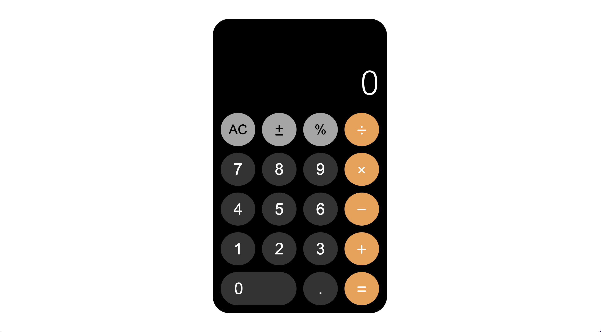

# Ios-Calculator

## Overview

### The challenge

Users should be able to:

- View the optimal layout for the component depending on their device's screen size
- See hover states for all interactive elements on the page
- Make simple mathematical calculations 
- Experience like the original IOS calculator

### Screenshot

### Links

- Live Site URL: https://yusuf-demirci.github.io/Ios-Calculator/

### Built with

- Semantic HTML5 markup
- CSS custom properties
- Grid
- Mobile-first workflow
- JavaScript & JQuery

